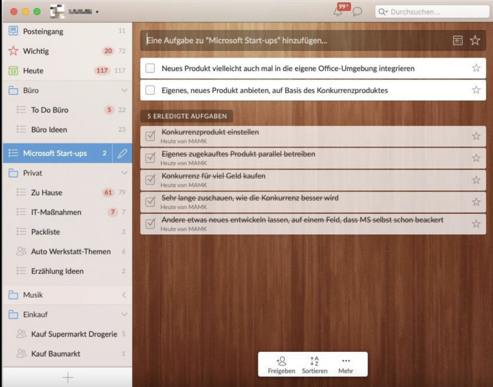
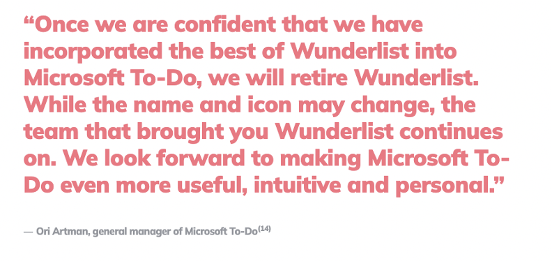
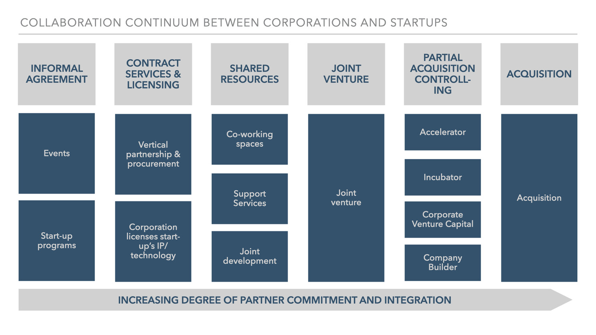

Just a simple post on XING by Christian Reber started the story of the startup 6Wunderkinder and their successful product Wunderlist. He was looking for people that would create a new approach to digital project management with him. The story of Wunderlist exemplifies one of the most discussed collaboration forms between corporations and startups: the acquisition.

In an interview, Christian Reber states that "When we started building Wunderlist, we've had a few key principles. We wanted to build a cross-platform product that works for individuals and teams. Whether you organize your personal shopping list or your house renovation or your student work, or if you run a big project and organize multiple companies, we wanted Wunderlist to work for everyone." [3] With five other people, he founded the company 6Wunderkinder and received in 2010 seed funding from among others High-Tech Gründerfonds and e42 GmbH. They developed a to-do and productivity app that combined a simple and intuitive user interaction with an excellent cross-platform experience. The app was free for users.

In 2011, Wunderlist reached the mark of 1 million users already after 275 days [4]. In the following years, 6Wunderkinder focused on rebuilding and updating the product, but dropped also in parallel the development of a project-management kit that was oriented towards business users [5]. Like this, they lost a potentially sustainable business model.

At that time, Microsoft was the largest provider of digital productivity solutions for private and business users but their biggest challenge was the user interaction and user experience. In 2014, Microsoft started to acquire IP and talent from innovative ventures that offered productivity tools [6,7]. Wunderlist was acquired in 2015 by Microsoft for an estimated price between 100 and 200 million US dollars. At that point in time, the product had 13 million users and showed a solid growth potential. Microsoft used the expertise of the 6Wunderkinder to develop their product Microsoft To Do and shut down Wunderlist in 2017. The acquisition as a form of corporate-startup collaboration represents the highest degree of partner commitment and integration.

## How Do Corporations Collaborate with Start-Ups?

A continuum of different collaboration forms evolved that shows an increasing degree of partner commitment and integration, from informal agreement to complete acquisition [13].

Many corporations use existing events like the Slush conference or the SXSW Pitch as a platform to inform themselves about new upcoming ventures and business models. A different option would be the implementation of standalone events for young ventures or entrepreneurs that for example focus on a certain strategic topic the corporation wants to evolve. With their Hackathon BCX20, Bosch developed such an event focusing on Internet of Things.

On the other hand, start-up programs initiated by corporations give young ventures access to learning tools and services and facilitate their development process like this. With its program Google for Startups, Google offers resources and access to a startup community to entrepreneurs.

Edeka exemplifies another option of corporate-startup collaboration with their Edeka Techstarter program. The current challenges, for example, optimal shelf availability, are published on their website and providers of solutions can submit their idea on the topic. Here, the venture requires to have an already in use or testable within three months solution and gets supported in piloting the solution onsite in an Edeka supermarket. The corporation is interested in licensing the technology made available and in creating a sustainable partnership.

The category of shared resources can be illustrated by the Villa Bonne Nouvelle established by the French telecommunication provider Orange. Start-ups can apply for office space at the Villa where also employees of Orange are located and eager to exchange.

The incubator Chemovator established by BASF depicts a great case of how a corporation can create an entrepreneurial community within a large organization. Employees of BASF are invited to submit their ideas to the program and if they pass the screening, a venture team can enter the incubator and undergo a validation and incubation phase before being spun in or spun off. The Chemovator core team and a group of entrepreneurs in residence team support the venture teams throughout the process.

## What Are the Benefits of Corporate-Startup Collaboration?

Corporations see several benefits within cooperation with a start-up [21,22,23]:

- Source of fresh talent and ideas for the corporate culture
- Innovative perception of the corporate brand in the public
- Development of new innovative solutions and products quicker and less risky for core business
- Expansion of business operations into new markets
- A solution to existing business challenges of the corporation

The benefits from the start-up perspective evolve around learning and growing processes [21,22,23]:

- Market knowledge and experience from the corporation
- Opportunity to test market fit of product in pilot testing
- Economies of scale and growth
- Access to established networks of corporation
- Corporate brand supporting venture's reputation

## What Are the Challenges of Corporate-Startup Collaboration?

On the other hand, corporations can experience severe challenges in their collaborations with start-ups [21,22,23]:

- Start-up's reluctance to reveal details of technology without NDA
- Potential brand abuse by the start-up
- Transfer of responsibilities between R&D unit and procurement department when collaboration enters stable partnership
- Commercial stability of start-up is evaluated low
- Resource requirements to create and maintain collaboration
- The cultural shock when corporate employees interact with venture teams

Start-ups suffer under the same challenges from a different perspective [21,22,23]:

- Missing speed in decision-making on the corporate side
- Identifying the relevant point of contact can take a long time due to the size of the organization
- Negotiation problems with corporate procurement and legal departments
- Cultural gaps lead to not-invented-here syndrome and lack of awareness on start-up methodologies within the corporate departments
- Insufficient resources provided and missing engagement by the corporation
- The lack of concrete, measurable goals in relation to the partnership makes it difficult to evaluate its success

## Taking Home Essentials

A huge variety of different collaboration forms between corporations and start-ups evolved over the years and probably will further develop in the future. The chosen form of collaboration shall always be driven by the purpose of the collaboration. If the corporation looks for a solution to a certain business problem, a strategic partnership with a fitting start-up makes sense. If the corporation wants to engage exploratory with new technologies and business models that are related to their own business area, the implementation of an accelerator or an incubator makes sense to create close cooperation.

Independent of what kind of collaboration form is chosen, the corporation needs to provide sufficient resources to it. Besides, the collaboration requires specific goal-setting as already described by Lang, Selig, Gutmann, Ortt & Baltes [24].

## References

[1] https://twitter.com/christianreber

[2] https://thenextweb.com/news/how-to-launch-your-own-startup-part-5-mentors-preparing-for-change-and-being-nice

[3] https://drt.fm/christian-reber

[4] https://web.archive.org/web/20120206012732/http:/www.6wunderkinder.com/blog/page/4/

[5] https://www.taskade.com/blog/wunderlist-history/#wunderlist-history

[6] https://blogs.microsoft.com/blog/2014/12/01/microsoft-acquires-acompli-provider-innovative-mobile-email-apps/

[7] https://blogs.microsoft.com/blog/2015/02/11/microsoft-acquires-sunrise-creator-innovative-calendar-app-mobile-devices/

[8] https://www.jstor.org/stable/24118777; https://onlinelibrary.wiley.com/doi/10.1002/(SICI)1097-0266(199907)20%3A7<655%3A%3AAID-SMJ44>3.0.CO%3B2-P; http://citeseerx.ist.psu.edu/viewdoc/summary?doi=10.1.1.194.5763

[9] https://www.hbs.edu/faculty/Pages/item.aspx?num=46

[10] https://sloanreview.mit.edu/article/managing-the-internal-corporate-venturing-process/

[11] https://www.jstor.org/stable/2393616?seq=1

[12] https://link.springer.com/book/10.1007/978-3-322-91343-2

[13] https://www.jstor.org/stable/pdf/2393756.pdf

[14] https://www.oxfordhandbooks.com/view/10.1093/oxfordhb/9780199546992.001.0001/oxfordhb-9780199546992-e-15

[15] https://onlinelibrary.wiley.com/doi/10.1002/smj.488

[16] https://www.econbiz.de/Record/strategic-venture-capital-investing-by-corporations-a-framework-for-structuring-and-valuing-corporate-venture-capital-programs-kann-antje/10004752827

[17] https://www.tandfonline.com/doi/abs/10.1080/08956308.2010.11657631

[18] https://onlinelibrary.wiley.com/doi/abs/10.1111/1467-8616.00259

[19] https://www.alexandria.unisg.ch/258545/

[20] https://www.jotmi.org/index.php/GT/article/view/3566

[21] https://www.nesta.org.uk/report/winning-together-a-guide-to-successful-corporate-startup-collaborations/

[22] https://www.tandfonline.com/doi/abs/10.1080/08956308.2010.11657631

[23] https://www.mckinsey.com/business-functions/mckinsey-digital/our-insights/cant-buy-love-corporate-start-up-partnerships-in-the-dach-region

[24] https://research.tudelft.nl/en/publications/guiding-through-the-fog-understanding-differences-in-the-goal-set
