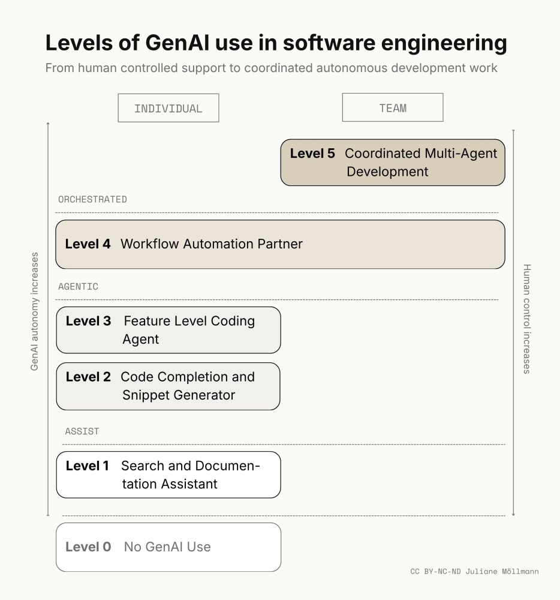

## GenAI Usage Levels among Software Engineers

Software engineering is one of the professional domains most visibly transformed by generative AI (GenAI). Coding assistants, chat-based programming tools, AI-supported code review, test generation, documentation tools, and increasingly agentic development environments are becoming part of everyday engineering work. Studies and industry reports suggest that these tools can improve productivity, especially for bounded and repetitive tasks. For example, experimental research on GitHub Copilot found that developers completed a programming task approximately 56% faster when using the tool [1], while other reports indicate more moderate productivity gains in real-world settings [2]. However, the impact of GenAI depends strongly on task type, developer experience, codebase complexity, tool setup, and human review [3]. As a result, GenAI adoption among software engineers should not be understood as a simple distinction between use and non-use.

Practitioner reports increasingly describe it as a staged development, ranging from occasional support for search, syntax, and explanation to deeper integration into coding, testing, review, debugging, documentation, and eventually broader workflow coordination. The following levels synthesize these practitioner-oriented descriptions into a structured framework for understanding how software engineers use GenAI in their daily work.

## Level 0: No GenAI Use

Level 0 describes engineers who work without any GenAI assistance [4,5]. Two distinct situations produce this: engineers who actively reject GenAI on grounds of quality, security, intellectual property, deskilling, or professional identity [6]; and engineers who would use it but lack access to approved tools or operate in environments where use is restricted. Engineers at this level may still use traditional development support, such as IDE-based autocomplete, syntax highlighting, and conventional search engines [5]. However, these tools do not generate substantial code or participate in reasoning about the task. The engineer remains fully responsible for searching, interpreting, writing, testing, and debugging code.

## Level 1: GenAI as Search and Documentation Assistant

At Level 1, software engineers use GenAI primarily as a conversational research partner, explanation tool, and documentation assistant [6]. Instead of searching Google, Stack Overflow, documentation pages, or internal wikis directly, engineers ask GenAI to explain concepts, compare libraries, summarize documentation, troubleshoot errors, or suggest possible implementation approaches through prompting [6,7]. The engineer asks questions, evaluates the answers, and manually applies relevant insights to their work. GenAI supports understanding and orientation, but it is not yet deeply embedded in the coding environment. It helps the engineer think, search, and learn faster, but the engineer still writes and integrates most of the code directly. In practice, this means asking for explanations of unfamiliar APIs, summarizing documentation, translating error messages into likely causes, generating small examples, or comparing alternative technical approaches.

## Level 2: GenAI as Code Completion and Snippet Generator

At Level 2, GenAI becomes part of the coding environment itself. Engineers use GenAI-enabled IDE extensions or coding assistants that suggest code while they work [5]. The engineer may write a few lines, define a function, add a comment, or start a pattern, and the tool completes the next lines or generates a useful code snippet [4]. At this level, GenAI contributes directly to code production, but mainly at the local, bounded-task level. The engineer still defines the structure of the implementation, decides what to accept, modifies the generated output, and remains closely involved in the code. GenAI-generated code typically accounts for a small fraction of the total, in practice, often under 20 percent of newly written lines [6]. Typical use cases include boilerplate generation, local function completion, test scaffolding, simple transformations, API call examples, and small utility functions. Unlike Level 1, these contributions appear inline in the editor rather than through a separate chat interface. The workflow is still engineer-led, but GenAI accelerates repetitive or predictable coding tasks.

## Level 3: GenAI as Feature Level Coding Agent

This level marks a shift from code completion to task execution. At Level 3, engineers routinely use agentic modes provided by modern development tools [5]. Instead of asking for isolated snippets, the engineer describes a larger task, such as building a feature, modifying several files, creating tests, or refactoring part of the system [6]. The GenAI tool can inspect project context, reason across files, propose implementation plans, and generate coordinated changes. In some cases, more than half of the code for a given task may be generated by AI, although the engineer still reviews, edits, tests, and approves the result [6]. Effective use at this level depends on the quality of the context provided to the tool [7]: relevant source files, project structure, dependency declarations, coding conventions, and issue descriptions. The richer the context, the more coherent the generated output. The engineer's role shifts toward task framing, context provision, review, debugging, and integration. Typical use cases include implementing a feature across multiple files, generating associated tests, updating documentation, refactoring modules, fixing bugs with project context, and adapting code to existing conventions.

## Level 4: GenAI as Workflow Automation Partner

At Level 4, the engineer's primary contribution shifts from writing code to designing the instructions that govern how GenAI writes it. Individual engineers or complete software engineering teams define instructions, task descriptions, acceptance criteria, repository rules, documentation standards, and agent guidelines [5]. These instructions may be stored in markdown files, project documentation, prompt libraries, or tool-specific configuration files. The agent uses these artifacts to perform larger and more repeatable parts of the workflow. At this level, GenAI can automate entire steps in the software development process, resulting in all code being written by GenAI [6]. The engineer no longer manipulates every line of code directly. Instead, the human role moves toward specification, instruction design, quality control, and exception handling [6]. Specialized GenAI tools may also emerge for particular tasks, such as testing, code review, migration, security checks, documentation, or dependency updates, and may be further adapted or fine-tuned by organizations for their own codebases, standards, and workflows [7]. Typical use cases include automated implementation from issue descriptions, GenAI-generated pull requests, documentation updates, test generation, code review assistance, migration tasks, release preparation, and specialized agents for recurring engineering tasks.

## Level 5: Coordinated Multi-Agent Software Development

At Level 5, software development involves orchestrating multiple specialized GenAI agents across several stages of the software development lifecycle [5]. Instead of one engineer using one assistant, a team manages a coordinated system of specialized agents. These agents exchange information and divide responsibility across the full delivery pipeline [7], from planning and coding through testing, review, documentation, deployment, and ongoing maintenance. At this level, the development process shifts from direct code production to supervising a GenAI-supported delivery system. A small team may guide several coordinated agents to produce an application or a major feature end-to-end [4]. Human engineers define goals, constraints, architecture, quality standards, and decision rules. The system handles many implementation details and raises only those decisions that require human judgment, such as architectural tradeoffs, product priorities, security implications, ethical concerns, or ambiguous requirements. This level is primarily team-based rather than purely individual [7]. It requires shared practices, governance, tool integration, monitoring, and clear accountability. Typical use cases include multi-agent feature delivery, coordinated design and implementation workflows, automated quality gates, GenAI-supported release pipelines, agent-based maintenance, and end-to-end software generation under human supervision. The central challenge is no longer simply whether GenAI can generate code, but how teams coordinate, validate, and govern GenAI-generated work across the software development lifecycle.

## Conclusion

For practitioners, the main implication is to treat GenAI adoption as a capability-building process rather than a tool rollout. Engineers and teams should first identify which level best reflects their current practice, then deliberately decide where deeper integration is useful and where it creates unnecessary risk. Early adoption should focus on bounded, low-risk tasks such as explanation, documentation, boilerplate generation, testing, and small refactorings. More advanced use requires stronger practices: clear prompting standards, shared repository instructions, explicit acceptance criteria, systematic code review, security checks, and accountability for GenAI-generated outputs. Teams moving toward agentic or multi-agent workflows should invest less in maximizing automation for its own sake and more in defining where human judgment must remain central. The goal is not to replace engineering expertise, but to reorganize it around problem framing, context design, validation, and responsible oversight.

Authors: Juliane Möllmann & Heini Koivu

## References

[1] Peng, S., Kalliamvakou, E., Cihon, P., & Demirer, M. (2023). The Impact of AI on Developer Productivity: Evidence from GitHub Copilot. https://doi.org/10.48550/arXiv.2302.06590

[2] Becker, J., Rush, N., Barnes, E., & Rein, D. (2025). Measuring the Impact of Early-2025 AI on Experienced Open-Source Developer Productivity. https://doi.org/10.48550/arXiv.2507.09089

[3] Vaithilingam, P., Zhang, T., & Glassman, E. L. (2022). Expectation vs. Experience: Evaluating the Usability of Code Generation Tools Powered by Large Language Models. Extended Abstracts of the 2022 CHI Conference on Human Factors in Computing Systems, New Orleans, LA, USA. https://doi.org/10.1145/3491101.3519665; Xu, F., Medappa, P. K., Tunc, M. M., Vroegindeweij, M., & Fransoo, J. C. (2025). AI-Assisted Programming Decreases the Productivity of Experienced Developers by Increasing the Technical Debt and Maintenance Burden. https://doi.org/10.48550/arXiv.2510.10165

[4] Relyea, C., & Harrysson, M. (2026). The AI revolution in software development. https://www.mckinsey.com/capabilities/tech-and-ai/our-insights/the-ai-revolution-in-software-development

[5] Faler, W. (2026). The 7 Levels of Software Engineering with AI. https://www.principalengineer.com/p/the-7-levels-of-software-engineering

[6] Struever, M., Kropp, M., & Bedard, J. (2025). From Dev Speed to Business Impact: The Case for AI-Assisted Coding and Generative Engineering. Retrieved 15-06-2026 from https://www.bcg.com/x/the-multiplier/ai-assisted-coding-generative-engineering

[7] Heimonen, J., & Koivisto, A. (2024). Handbook for AI-Powered Developers. https://campaign.siili.com/ai-powered-development-whitepaper

[8] Photography from Chris Ried on Unsplash. https://unsplash.com/de/fotos/ein-computerbildschirm-mit-einem-haufen-code-darauf-ieic5Tq8YMk
