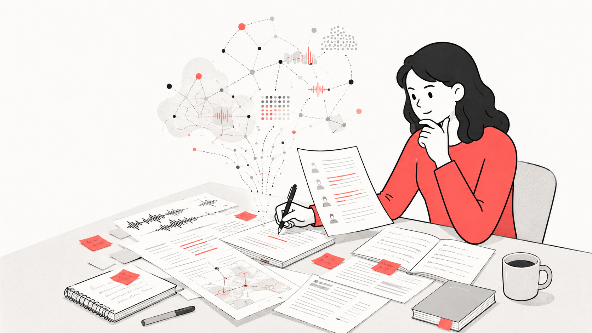
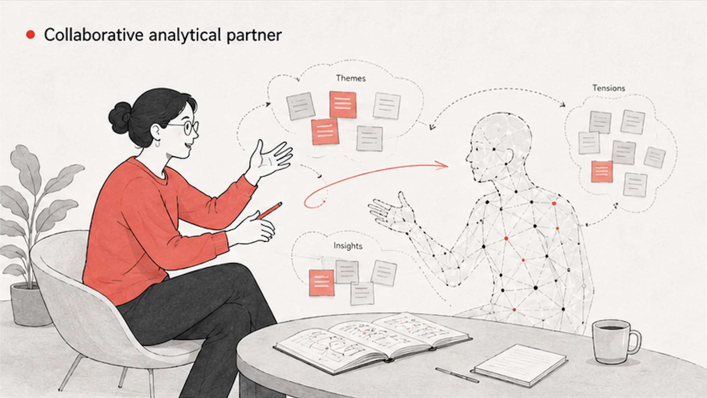

Artificial intelligence is not entirely new to management and organizational research. Researchers have long used machine-learning techniques to identify patterns, classify material, and support the analysis of large datasets. These earlier applications, however, were concentrated primarily in quantitative and mixed-methods research. They generally required specialized expertise and served as analytical tools, with researchers supplying data, selecting procedures, and interpreting the results. Generative AI marks both a continuation of this development and a significant discontinuity. Large language models are general-purpose, conversational, and widely accessible for academics [1-3].

> "Given that much scholarly work in project studies, as well as management and organizational research in general, involves analyzing and creating texts, these emerging technologies promise much."
>
> — Geraldi et al. (2024, p. 1) [2]

The academic response to this development, however, has been mixed. Since the release of ChatGPT, several warning signs have emerged. Journals have experienced a sharp increase in submissions, AI-generated text has become more visible in manuscripts [1]. These developments raise concerns that GenAI may encourage the production of more academic text without a corresponding improvement in scholarly quality [2;3].

> "Submission volume has risen 42% since the late 2022 release of ChatGPT, while writing quality has declined."
>
> — Gartenberg et al. (2026, p. 1) [1]

At the same time, there is widespread recognition of GenAI's potential. The central issue is therefore not simply whether researchers use it, but how they use it. When GenAI is treated primarily as a text generator, it may increase output while weakening substantive engagement. When used more interactively, however, it may support rather than substitute for researchers' intellectual work. This tension invites us to reconsider the place of AI in qualitative inquiry. Rather than viewing GenAI only as a passive software tool, recent literature increasingly describes it as a "co-researcher," "cognitive partner," or collaborative research partner [4,5].

> "Instead of mere tools, AI is increasingly conceptualized as a co-researcher or research partner--an epistemic agent that helps in the analysis, interpretation, and reflexivity of data."
>
> — Costa et al. (2025, p. 1) [4]

The value of this perspective is not that it attributes human understanding to the system. Rather, it draws attention to what becomes possible when researchers use GenAI dialogically. A conventional tool performs a specified operation; a collaborative partner can introduce an unexpected comparison, formulate a counterinterpretation, expose an ambiguity, or prompt researchers to make tacit assumptions explicit [4,5]. This shift is especially relevant to qualitative research since interpretation of data is rarely a linear procedure. Researchers move repeatedly between empirical material, provisional codes, theoretical concepts, contextual knowledge, and emerging explanations. GenAI can support these movements by proposing connections and alternative readings for researchers to examine.

Understanding GenAI as a collaborative partner therefore does not diminish the researcher's role. It makes that role more demanding. GenAI can suggest, compare, question, and reformulate, but the human researcher remains responsible for meaning. AI-generated interpretations must be checked against the source material, domain knowledge, research objectives, and the methodological commitments of the study [4,5].

> "The literature shows that researchers need to do more than just analyze data; they must also critically interpret AI-generated insights to verify that they are relevant and ethical."
>
> — Costa et al. (2025, p. 2) [4]

The collaborative metaphor must therefore be understood asymmetrically. GenAI may contribute to the interpretive process, but it cannot bear accountability for the resulting knowledge claims. It has no responsibilities toward research participants, scholarly communities, or society. Those responsibilities remain with the researcher [4,5].

The central question is consequently not whether GenAI can replace qualitative researchers. It is how researchers can work with GenAI in ways that expand their analytical possibilities while preserving human judgment, reflexivity, and responsibility. GenAI creates an additional space for dialogue within the research process. Whether that dialogue improves qualitative inquiry depends on how deliberately, critically, and responsibly researchers conduct it.

## References

[1] Gartenberg, C., Hasan, S., Murray, A., & Pierce, L. (2026). More versus better: Artificial intelligence, incentives, and the emerging crisis in peer review. *Organization Science*. https://doi.org/10.1287/orsc.2026.ed.v37.n3

[2] Geraldi, J., Locatelli, G., Dei, G., Söderlund, J., & Clegg, S. (2024). AI for management and organization research: Examples and reflections from project studies. *Project Management Journal, 55*(4), 339-351. https://doi.org/10.1177/87569728241266938

[3] von Krogh, G., Roberson, Q., & Gruber, M. (2023). Recognizing and utilizing novel research opportunities with artificial intelligence [Editorial]. *Academy of Management Journal, 66*(2), 367-373. https://doi.org/10.5465/amj.2023.4002

[4] Costa, A. P., Bryda, G., Christou, P. A., & Kasperiuniene, J. (2025). AI as a co-researcher in the qualitative research workflow: Transforming human-AI collaboration. *International Journal of Qualitative Methods, 24*, 16094069251383739. https://doi.org/10.1177/16094069251383739

[5] Jones, K. M. L. (2025). Generative AI in qualitative research and related transparency problems: A novel heuristic for disclosing uses of AI. *International Journal of Qualitative Methods, 24*, 16094069251404329. https://doi.org/10.1177/16094069251404329

[6] Gioia, D. A., Corley, K. G., & Hamilton, A. L. (2013). Seeking Qualitative Rigor in Inductive Research. *Organizational Research Methods, 16*(1), 15–31. https://doi.org/10.1177/1094428112452151